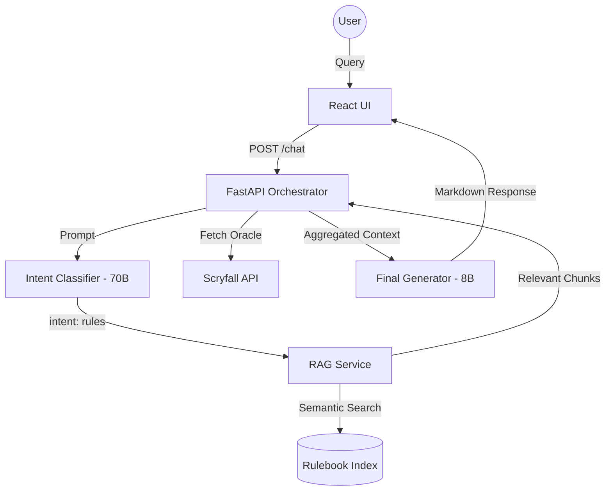
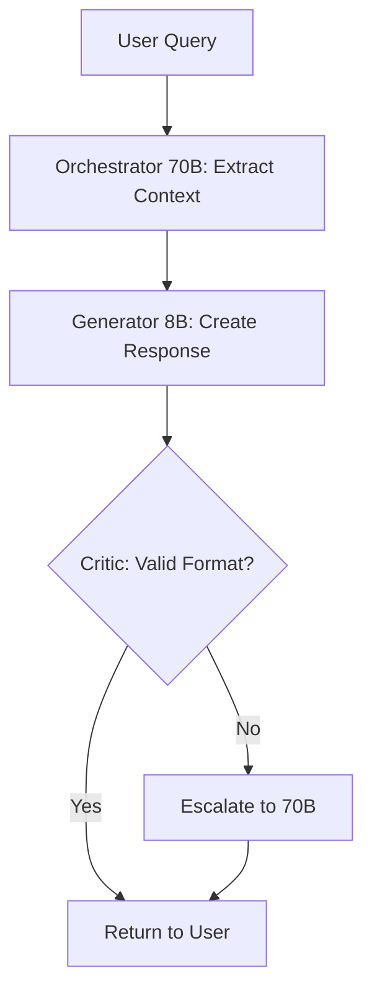

# 🔮 MTG Rulebook AI Judge: Comprehensive Guide

This guide is a deep dive into the architecture, logic, and design patterns of the MTG Rulebook AI Judge. It is intended for developers or students who wish to understand how a high-performance RAG-based AI system is built for a complex domain like Magic: The Gathering.

---

## 📖 Table of Contents
1.  [System Overview](#1-system-overview)
2.  [The Tech Stack](#2-the-tech-stack)
3.  [Backend Architecture](#3-backend-architecture)
4.  [Frontend Architecture](#4-frontend-architecture)
5.  [Critical AI Patterns](#5-critical-ai-patterns)
6.  [Data Ingestion & Indexing](#6-data-ingestion--indexing)
7.  [Market Intelligence Engine](#7-market-intelligence-engine)
8.  [Logging & Data Harvesting](#8-logging--data-harvesting)
9.  [Deployment & Maintenance](#9-deployment--maintenance)
10. [The Vision: Future Roadmap](#10-the-vision-future-roadmap)

---

## 1. System Overview
The **MTG Rulebook AI Judge** is an **Expert System** designed to bridge the gap between natural language queries and the 250+ pages of the official Magic: The Gathering Comprehensive Rules.

### The Problem: Rule Complexity
MTG rules are hierarchical and state-dependent. A simple question like *"What happens if I cast this?"* requires:
1.  **Entity Extraction**: Identifying which card(s) are being discussed.
2.  **State Resolution**: Understanding the current phase, priority, and board state.
3.  **Semantic Retrieval**: Finding the specific rule subset (e.g., Rule 702.13 for Trample).
4.  **Logical Assembly**: Combining the card text with the rules to form a coherent answer.

### High-Level Data Flow


---

## 2. The Tech Stack Deep Dive

### LLM Inference: Groq LPU™
We utilize **Groq** for its Language Processing Units (LPUs), which provide sub-second "time-to-first-token." This is critical for maintaining a conversational feel during complex rules analysis.

-   **Model Selection Strategy**:
    -   `llama-3.3-70b-versatile`: Our **Orchestrator**. Used where precision is non-negotiable (Intent classification, Card extraction).
    -   `llama-3.1-8b-instant`: Our **Generator**. Used for persona-driven output. It is roughly 10x faster and cheaper than the 70B model.

### The Backend: FastAPI
FastAPI provides the asynchronous backbone. Unlike Flask, it allows for high-concurrency requests, which is vital when multiple LLM calls and API fetches (Scryfall + CardTrader) happen in parallel.

### Vector Search: Semantic Similarity
Instead of a simple keyword search (which fails on complex phrasing), we use **Sentence Embeddings**.
-   **Model**: `all-MiniLM-L6-v2` (via `sentence-transformers`).
-   **Logic**: Every rule is mapped to a 384-dimensional vector. The user's query is also mapped to this space. We calculate the **Cosine Similarity** to find the closest matches.

---

## 3. Backend Architecture (Deep Dive)

### The `ChatController`: The Central Routing Engine
The `ChatController` (`backend/app/services/chat_controller.py`) is the most important file in the backend. It does not perform LLM inference itself; instead, it coordinates all other services.

#### Code Snippet: Intent Routing
This snippet shows how the controller decides which "specialist" should handle the query:
```python
def process_message(self, user_input, history, smart_mode=False, context=None):
    # 1. Intent Classification (70B Model)
    intent = self.llm.classify_intent(user_input, history)
    
    # 2. Specialist Routing
    if intent == "lookup":
        response = self._handle_lookup(user_input, history, selected_model)
    elif intent == "market":
        response = self._handle_market(user_input, history, selected_model)
    elif intent == "rules":
        response = self._handle_rules(user_input, history, selected_model)
    # ...
```

### Specialist Handlers
-   **`_handle_rules`**: This is the most complex path. It triggers the `RAGService` to find official rules and the `CardService` to fetch the exact Oracle text of cards mentioned in the query.
-   **`_handle_market`**: Instead of rules, it calls the `MarketIntelligenceService` to pull pricing from Scryfall and CardTrader, then calculates spreads.

---

## 4. Frontend Architecture (Deep Dive)

### State Management: The History Buffer
The frontend (`frontend/src/components/ChatInterface.jsx`) maintains the conversational state. It does not send the *entire* chat history to the backend (to save tokens). Instead, it maintains a sliding window of the last 8 messages.

#### Code Snippet: History Management
```javascript
const handleSendMessage = async () => {
    // ... fetch logic ...
    const data = await response.json();

    // Update history (keep last 8 interactions for context)
    const newHistory = [...history, userText, data.response];
    if (newHistory.length > 8) newHistory.splice(0, newHistory.length - 8);
    setHistory(newHistory);
};
```

### Component Hierarchy
1.  **`App.jsx`**: Main container and theme provider.
2.  **`ChatInterface.jsx`**: Logic for input handling, model toggling (8B/70B), and history tracking.
3.  **`MessageBubble.jsx`**: Pure UI component for rendering Markdown. It also contains the **Feedback Loop** (Thumbs Up/Down) that hits the `/api/feedback` endpoint.

---

## 5. Critical AI Patterns

### The Orchestrator & Generator (Model Scaling)
We solve the "Cost vs. Accuracy" trade-off by using two models. The **70B (Orchestrator)** is responsible for extraction and classification. The **8B (Generator)** is responsible for the creative/persona aspect.

### The Critic Pattern & Escalation Loop
A response is only as good as its facts. In our "Gold Standard" mode, the system follows this logic:


#### Code Snippet: The Critic Logic (`LLMService.validate_format`)
```python
def validate_format(self, text):
    """Checks if the response follows the 4-section format."""
    required_keywords = ["CARD INFO", "ORACLE TEXT", "RULING", "GAMEPLAY SCENARIO"]
    text_upper = text.upper()
    missing = [kw for kw in required_keywords if kw not in text_upper]
    return len(missing) == 0, missing
```

### Prompt Engineering: The "Force Truth" Pattern
In `backend/app/core/config.py`, we use high-coercion prompts. For example, in `PROMPT_JUDGE`, we include:
> "CRITICAL: You MUST use the following 4-section format for EVERY query. NEVER skip a section."

This helps the 8B model stay within the rails, minimizing the need for the expensive 70B escalation.

---

## 6. Data Ingestion & Indexing (RAG)

The RAG (Retrieval-Augmented Generation) pipeline ensures that the Judge never "hallucinates" rules.

### The Indexing Process
1.  **Rulebook Parsing**: `src/indexer.py` reads the 2025 Comprehensive Rules and splits them by rule number (e.g., "101.1").
2.  **Vectorization**: Each rule is passed through `SentenceTransformer`.
3.  **Persistence**: The embeddings and text chunks are saved as a `pickle` object in `data/rulebook_index.pkl`.

### Mathematical Logic: Cosine Similarity
We use the **Dot Product** divided by the product of the **Norms** to find the most relevant rules:
$$similarity = \frac{A \cdot B}{\|A\| \|B\|}$$

#### Code Snippet: Similarity Search (`RAGService.retrieve`)
```python
def retrieve(self, query, history=None, top_k=TOP_K_CHUNKS):
    # 1. Encode query
    query_embedding = self.model.encode([search_query])[0]
    
    # 2. Calculate similarities across the entire rulebook
    similarities = np.dot(chunk_embeddings, query_embedding) / (
        np.linalg.norm(chunk_embeddings, axis=1) * np.linalg.norm(query_embedding)
    )
    
    # 3. Sort and return top indices
    top_indices = np.argsort(similarities)[-top_k:][::-1]
    return [self.index_data['chunks'][i] for i in top_indices]
```

---

## 7. Market Intelligence Engine

The Market Engine (`backend/app/services/market.py`) provides financial transparency.

### Price Spread & Arbitrage
-   **Spread**: The range between the highest and lowest listing for a specific card version.
-   **Arbitrage**: The percentage difference between Cardmarket (EU) and CardTrader (Intl).

#### Code Snippet: Spread Calculation
```python
# Spread logic in MarketIntelligenceService
if eur_prices:
    high = max(eur_prices)
    low = min(eur_prices)
    spread_val = high - low
    stats["spread"] = f"{spread_val:.2f}€ (Current Range)"
```

### Dynamic Link Generation
The `backend/app/utils/market_links.py` file uses slugification to ensure links to stores are always valid, even with cards containing complex characters (e.g., *Urza's Saga*).

---

## 8. Logging & Data Harvesting (The Gold Loop)

The system is designed to "get smarter over time" by harvesting its own high-quality outputs.

### The "Gold Standard" interaction
When the 70B model responds perfectly, the system logs the interaction into `logs/interactions.jsonl`. This forms a synthetic dataset for future fine-tuning.

#### Sample Log Structure
```json
{
  "timestamp": "2025-12-21T09:00:00",
  "query": "Does Blood Moon affect basic lands?",
  "context": {"cards": ["Blood Moon"]},
  "response": "1. 🃏 CARD INFO: Blood Moon...",
  "model": "llama-3.3-70b-versatile",
  "quality_score": 1.0
}
```

### Feedback & Reporting
The `/api/feedback` and `/api/report` endpoints allow users to manually tag data. A "Thumbs Up" moves an interaction into the **Candidate for Fine-tuning** bucket.

---

## 9. Deployment & Maintenance

### Automation with `Makefile`
The project uses a standard `Makefile` to ensure consistency across development environments:
-   `make setup`: Installs dependencies and runs `src/data_setup.py`.
-   `make run`: Starts the FastAPI server and Vite frontend.
-   `make benchmark`: Runs a suite of test cases to verify the Judge’s persona and rules accuracy.

### CLI Debugging (`src/cli.py`)
For developers, the `src/cli.py` tool provides a raw interface to test intent classification and RAG retrieval without the overhead of the web UI. It includes specialized handlers for debugging the token usage per turn.

---

## 10. The Vision: Phase 4 & Beyond

The most ambitious goal is moving from **Textual Reasoning** to **Structural Calculation**.

### The "Layer System" Challenge
RAG is excellent for text, but Magic's "Layer System" (Rule 613) is a sequential logic engine.
1.  **Copy effects**
2.  **Control-changing effects**
3.  **Text-changing effects**
4.  ...
5.  **Power/Toughness effects**

### The Solution: JSON Logic Engine
In Phase 4, the Judge will convert card text into **JSON ASTs** (Abstract Syntax Trees). Instead of "reading" the rules, it will "calculate" the final board state by executing the logic tree through the Layer layers. This eliminates the last 1% of LLM reasoning errors.

---
*End of Study Guide. Built for depth, accuracy, and engineering excellence.*
